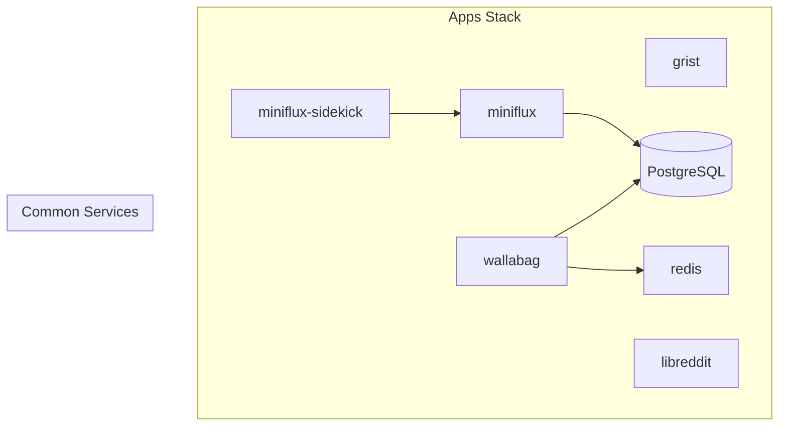
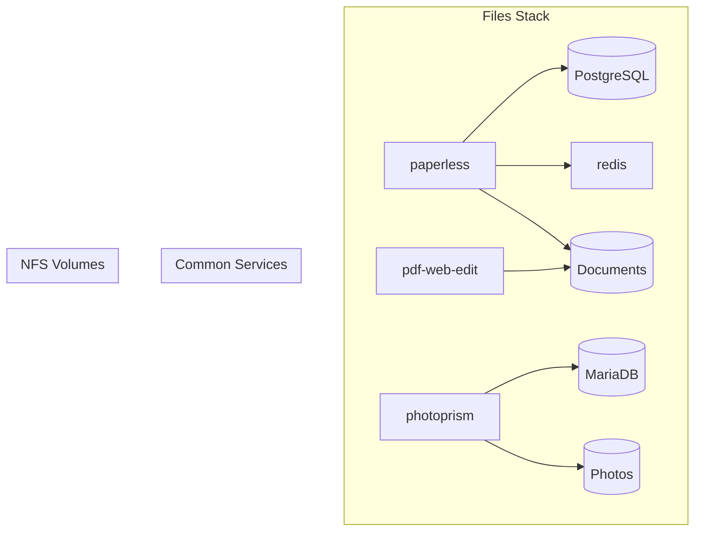
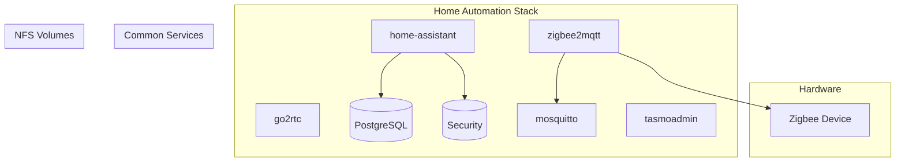
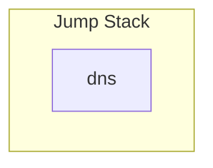
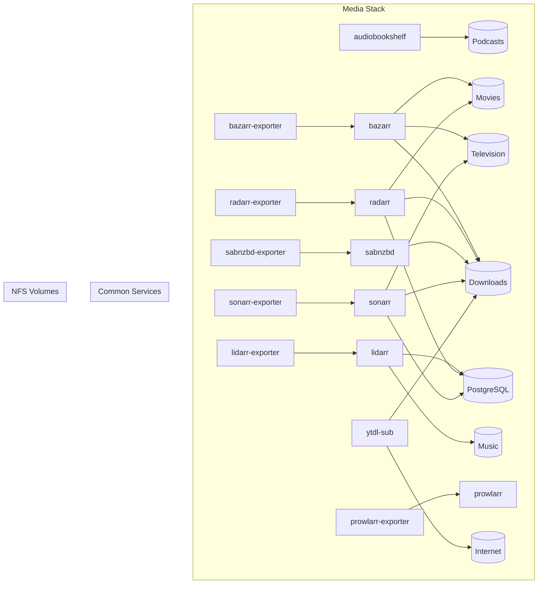
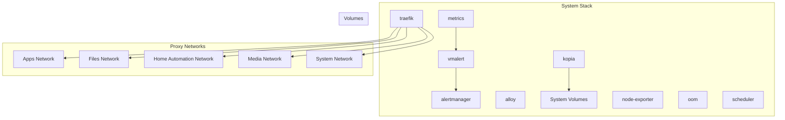
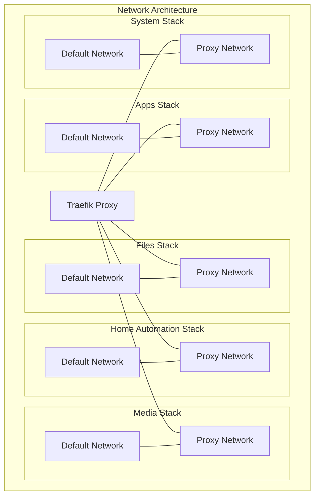

# Docker Compose Services Documentation

This document provides an overview of all services in the docker compose stacks in this project, with brief descriptions and diagrams showing their relationships.

## Table of Contents

- [Overview](#overview)
- [Stacks](#stacks)
  - [Apps Stack](#apps-stack)
  - [Files Stack](#files-stack)
  - [Home Automation Stack](#home-automation-stack)
  - [Jump Stack](#jump-stack)
  - [Media Stack](#media-stack)
  - [System Stack](#system-stack)
- [Common Services](#common-services)
  - [PostgreSQL](#postgresql)
  - [MariaDB](#mariadb)
- [Network Architecture](#network-architecture)
- [Volume Management](#volume-management)

## Overview

This project is organized into multiple docker compose stacks, each serving a specific purpose:

1. **Apps Stack**: General-purpose applications for productivity and information management
2. **Files Stack**: File management, document processing, and photo management
3. **Home Automation Stack**: Smart home management and automation
4. **Jump Stack**: Network services
5. **Media Stack**: Media management, downloading, and streaming
6. **System Stack**: Infrastructure monitoring, alerting, and management

Each stack is defined in its own compose file and may include common services like databases.

## Stacks

### Apps Stack

The Apps stack provides general-purpose applications for productivity and information management.

**Services:**

| Service | Description |
|---------|-------------|
| **grist** | Spreadsheet and database application for structured data management |
| **libreddit** | Privacy-focused Reddit frontend (previously libreddit, now redlib) |
| **miniflux** | RSS feed reader for news and content aggregation |
| **miniflux-sidekick** | Helper service for miniflux |
| **redis** | In-memory data structure store used by other services |
| **wallabag** | Self-hosted read-it-later application for saving web articles |

**Dependencies:**
- Includes PostgreSQL from common services

**Diagram:**

### Files Stack

The Files stack manages documents, photos, and file processing.

**Services:**

| Service | Description |
|---------|-------------|
| **paperless** | Document management system for scanning, OCR, and organizing documents |
| **pdf-web-edit** | Web-based PDF editing and processing tool |
| **photoprism** | Photo management and organization with AI-powered features |
| **redis** | In-memory data structure store used by other services |

**Dependencies:**
- Includes PostgreSQL from common services (used by paperless)
- Includes MariaDB from common services (used by photoprism)
- Uses NFS volumes for document and photo storage

**Diagram:**

### Home Automation Stack

The Home Automation stack manages smart home devices and automation.

**Services:**

| Service | Description |
|---------|-------------|
| **go2rtc** | Real-time communication server for video streaming |
| **home-assistant** | Core home automation platform for controlling smart devices |
| **mosquitto** | MQTT broker for IoT device communication |
| **tasmoadmin** | Management interface for Tasmota-powered devices |
| **zigbee2mqtt** | Bridge for Zigbee devices to communicate via MQTT |

**Dependencies:**
- Includes PostgreSQL from common services (used by home-assistant)
- Uses NFS volume for security camera footage

**Diagram:**

### Jump Stack

The Jump stack provides network services.

**Services:**

| Service | Description |
|---------|-------------|
| **dns** | Technitium DNS server for local DNS resolution |

**Diagram:**

### Media Stack

The Media stack manages media content, downloads, and streaming.

**Services:**

| Service | Description |
|---------|-------------|
| **audiobookshelf** | Audiobook and podcast server |
| **bazarr** | Subtitle management for movies and TV shows |
| **bazarr-exporter** | Metrics exporter for bazarr |
| **lidarr** | Music collection manager |
| **lidarr-exporter** | Metrics exporter for lidarr |
| **prowlarr** | Indexer manager/proxy for other services |
| **prowlarr-exporter** | Metrics exporter for prowlarr |
| **radarr** | Movie collection manager |
| **radarr-exporter** | Metrics exporter for radarr |
| **sabnzbd** | Usenet download manager |
| **sabnzbd-exporter** | Metrics exporter for sabnzbd |
| **sonarr** | TV show collection manager |
| **sonarr-exporter** | Metrics exporter for sonarr |
| **ytdl-sub** | YouTube downloader and subscription manager |

**Dependencies:**
- Includes PostgreSQL from common services
- Uses NFS volumes for media storage

**Diagram:**

### System Stack

The System stack provides infrastructure monitoring, alerting, and management.

**Services:**

| Service | Description |
|---------|-------------|
| **alertmanager** | Handles alerts from monitoring systems |
| **alloy** | Grafana Alloy for observability |
| **kopia** | Backup system for data protection |
| **metrics** | Victoria Metrics for time-series data storage |
| **node-exporter** | Exports system metrics for monitoring |
| **oom** | Monitors for out-of-memory events |
| **scheduler** | Chadburn job scheduler for running periodic tasks |
| **traefik** | Reverse proxy and load balancer for service access |
| **vmalert** | Alerting for Victoria Metrics |

**Diagram:**

## Common Services

### PostgreSQL

PostgreSQL is a powerful, open-source object-relational database system used by multiple services across different stacks.

**Used by:**
- Apps Stack: miniflux, wallabag
- Files Stack: paperless
- Home Automation Stack: home-assistant
- Media Stack: lidarr, radarr, sonarr

**Features:**
- Automatic backups every 12 hours
- Health checks
- Data persistence via volumes

### MariaDB

MariaDB is an open-source relational database that's a fork of MySQL, used primarily by the photoprism service.

**Used by:**
- Files Stack: photoprism

**Features:**
- Automatic backups every 12 hours
- Health checks
- Data persistence via volumes
- Optimized configuration for performance

## Network Architecture

Each stack has its own default network and a proxy network that connects to the Traefik reverse proxy in the System stack. This allows for:

1. Isolation between stacks for security
2. Controlled access to services via the Traefik proxy
3. Proper service discovery within each stack

## Volume Management

The project uses a combination of local volumes and NFS mounts for data storage:

1. **Local Volumes**: Used for service-specific data, configuration, and databases
2. **NFS Volumes**: Used for shared media and document storage

NFS volumes are mounted from a central file server (defined by the `FILEHOST` environment variable) and include:

- `/documents`: Document storage for paperless and pdf-web-edit
- `/photos`: Photo storage for photoprism
- `/security`: Security camera footage for home-assistant
- `/downloads`: Download directory for media services
- `/movies`: Movie library
- `/television`: TV show library
- `/music`: Music library
- `/podcasts`: Podcast library
- `/internet`: Internet content for ytdl-sub

This architecture allows for centralized storage while providing access to the services that need it.
